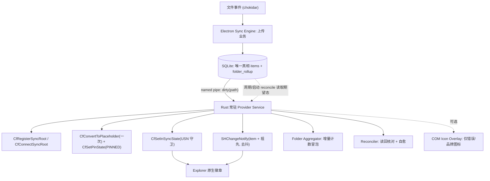

# GyenBox Desktop — 完美同步实现蓝图(Windows Cloud Files Provider)

目标读者:实现者。本文给出"把同步做到极致"的具体设计,而非原理科普。
配套:验收标准见 `desktop-dropbox-parity-acceptance.md`;现状问题见 `AUDIT-LOG.md` R3。

---

## 1. 目标与非目标

**目标**
- Explorer 的 ✅ 是"系统级可信闭环":桌面 UI、SQLite、Explorer 三者状态恒等且可证明。
- 文件永远是本地真实文件(不被意外脱水),同时拿到原生 Cloud Files 徽章。
- 文件夹状态由子孙实时聚合冒泡;断网、重启、改名、空文件、深层目录都不丢状态。

**非目标(本蓝图不解决)**
- 双向下行同步 / 冲突合并(只预留状态位 `conflict`)。
- 大文件分块续传(先单 PUT,接口已是 reserve+complete)。

---

## 2. 核心决策

> **做成常驻 Cloud Files provider,运行在"全部 PINNED、永不脱水的镜像"模式。**

理由:`CfSetPinState(PINNED)` 后 Storage Sense 不脱水 → 文件始终在本地 → 消除 R3/P0-2 的数据风险;注册成 sync root 后 ✅ 是**系统画的**,绿勾不需要 COM overlay;连了 provider 才能用 USN 守卫与 `NOTIFY_RENAME`。**overlay handler 降为可选**,仅用于平台不画的"错误"红标。

---

## 3. 架构总览



职责边界:**Electron 只管 UI / 登录 / 上传 / 写 SQLite**;**Rust provider 独占 CfApi 与 Explorer 状态**;**SQLite 是唯一真相,内存队列只是它的投影**。

---

## 4. 状态存储(SQLite)

```sql
CREATE TABLE items (
  path            TEXT PRIMARY KEY,   -- 相对路径, 正斜杠
  is_dir          INTEGER NOT NULL,
  remote_id       TEXT,
  remote_revision TEXT,
  content_hash    TEXT,               -- 文件内容 sha256, 目录为空
  local_size      INTEGER,
  local_mtime_ms  INTEGER,
  usn             INTEGER,            -- 最近观测到的 USN
  placeholder     INTEGER NOT NULL DEFAULT 0,  -- 是否已转占位符(只转一次)
  pin_state       TEXT,
  sync_state      TEXT NOT NULL,      -- 见 §5
  cloud_state     TEXT,               -- 我们最后设置的 in-sync 态: in_sync|not_in_sync
  last_error      TEXT,
  attempt         INTEGER NOT NULL DEFAULT 0,
  updated_at      TEXT NOT NULL
);
CREATE INDEX items_state_idx ON items(sync_state);

-- 文件夹聚合计数(增量维护, 不全树重算)
CREATE TABLE folder_rollup (
  path    TEXT PRIMARY KEY,
  total   INTEGER NOT NULL DEFAULT 0,
  synced  INTEGER NOT NULL DEFAULT 0,
  syncing INTEGER NOT NULL DEFAULT 0,
  queued  INTEGER NOT NULL DEFAULT 0,
  failed  INTEGER NOT NULL DEFAULT 0
);
```

迁移注意:`local_files` → `items` 是加列即可(SQLite `ALTER TABLE ADD COLUMN`),保留旧数据。

---

## 5. 状态机(`sync_state`)

```
discovered → queued → uploading → uploaded → verifying → in_sync
                                    ↘ failed   ↘ conflict
in_sync/uploaded --(本地又改, USN 前进)--> dirty → queued
任意 --(本地删除)--> deleted(清理占位符元数据后移除行)
```

铁律:**只有经过 USN 校验通过,才允许进入 `in_sync`**(见 §7.1)。

---

## 6. Provider 回调清单(`CfConnectSyncRoot` 的 `CF_CALLBACK_REGISTRATION`)

| 回调 | 必需 | 职责(镜像模式) |
|------|------|------------------|
| `FETCH_DATA` | ✅ 必需 | 占位符被脱水后回填:从 `/api/download/:id` 取字节,`CfExecute(TRANSFER_DATA)` 分块回写。PINNED 下罕见,但必须实现作兜底。 |
| `CANCEL_FETCH_DATA` | 建议 | 取消进行中的回填,释放资源。 |
| `NOTIFY_RENAME` / `_COMPLETION` | ✅ 关键 | 用户改名/移动:在 `items` 改 path、保 `remote_id`,不退化成 delete+add(满足标准 5)。 |
| `NOTIFY_DELETE` / `_COMPLETION` | ✅ 关键 | 用户删除:标 `deleted`,排队云端删除。 |
| `NOTIFY_FILE_OPEN/CLOSE_COMPLETION` | 建议 | 探测本地编辑,close 后触发重新哈希与重传判断。 |
| `VALIDATE_DATA` | 可选 | 校验回填数据完整性。 |

> 不要用 `windows-sys` 裸 FFI 写回调表(`CF_OPERATION_INFO` 编组极易错)。用高层 `windows` crate 或社区 `cloud-filter` crate。

---

## 7. 关键算法

### 7.1 USN 守卫(防"标完勾文件又被改"的竞态)
```
读取待上传内容 → 记录 usn0(CfConvertToPlaceholder/CfGetPlaceholderInfo 的 out USN)
上传(基于该内容)完成
再读 usn1
若 usn1 == usn0:  CfSetInSyncState(handle, IN_SYNC, NONE, &usn0)   // 带 USN, 一致才生效
否则:             sync_state = dirty; 重新入队            // 上传途中被改了, 不标勾
```
`CfSetInSyncState` 的 `InSyncUsn` 是乐观并发检查:USN 不符则失败,绝不会把脏内容标成已同步。

### 7.2 占位符只转一次
mark 前先 `GetFileInformationByHandleEx(FileAttributeTagInfo)` 看是否已是占位符(`FILE_ATTRIBUTE_RECALL_ON_DATA_ACCESS` / reparse tag);已是则跳过 `CfConvertToPlaceholder`,只 `CfSetInSyncState`。**禁止对 queued/uploading 文件转占位符**——只有进入 `uploaded` 后才转。(修 R3/P1-2)

### 7.3 文件夹增量聚合
```
叶子状态 X→Y 时:
  for 祖先 in 路径祖先链:
     folder_rollup[祖先] 对应计数 -1(X), +1(Y)
     agg = failed>0 ? error : syncing>0 ? syncing : queued>0 ? queued : (synced==total ? in_sync : not)
     若 agg 变化: 标该文件夹 in-sync 态 + 入"待通知"集合
合并去抖 100–300ms 后批量 SHChangeNotify(每个变化文件夹 + 其父)
```
比"启动全树重算"实时、且 O(深度) 而非 O(N)。满足标准 2/3/4 的实时性。

### 7.4 自愈 Reconciler(trustworthy 的核心)
```
触发: 启动 / 网络恢复 / 定时(5min) / 用户点 Repair
for 每个跟踪项:
   读回实际态 = CfGetPlaceholderStateFromFileInfo + 属性 + pin
   期望态 = items.sync_state/cloud_state
   不一致 → 重新执行 §7.2/§7.1/SHChangeNotify 修复, 记日志
```

### 7.5 队列即投影
不再用内存 Map 当真相。"待办 = `items WHERE sync_state NOT IN (in_sync)`"。崩溃重启后自动恢复,无需特殊逻辑。

---

## 8. IPC 设计

- Provider 常驻,持有 `CfConnectSyncRoot` 的 connection key。
- Electron 写完 SQLite 后,经命名管道 `\\.\pipe\gyenbox-sync` 发一行 `{"dirty":"<path>"}` 唤醒 provider(低延迟)。
- Provider 同时低频自 reconcile(兜底丢消息)。
- 单一真相是 SQLite;管道只是"该看一下了"的信号,不携带状态。
- Provider 崩溃:Electron 监控并重启;重启即 reconcile。

---

## 9. 诊断与验收

### 9.1 `gyenbox-sync.exe cloud-diagnose <root>`(只读)
对每个跟踪路径输出 JSON:`{path, db_state, cloud_in_sync, is_placeholder, pin_state, consistent}`。用于 Repair 按钮与验收断言。

### 9.2 验收脚本(把 `desktop-dropbox-parity-acceptance.md` 10 条自动化)
每个场景执行后跑 `cloud-diagnose` 断言 `consistent==true`:
1 上传文件→✅ / 2 文件夹全成→文件夹✅ / 3 子项 syncing→文件夹同步中 / 4 子项 failed→文件夹异常 / 5 移动·改名·空文件·子文件夹不丢状态 / 6 重启 GyenBox 恢复 / 7 重启 Explorer 仍对 / 8 断网恢复自动矫正 / 9 三方一致 / 10 强制通知 + Repair。

> **"极致"的定义 = 这套断言在所有场景恒等**,而不是"看起来有勾"。

---

## 10. 分版本落地(到文件级)

### 0.1.15 — 止血 + 诊断(不引入 provider)
- **修编译**:`apps/desktop/src/main/main.ts` 声明并接线 `cloudStatusReconcileTimer`,或删 `scheduleCloudStatusReconciliation`。(R3/P0-1)
- **占位符只转一次**:`crates/gyenbox-sync/src/cloud_files.rs` `mark_path` 加 §7.2 守卫;`uploaded` 才转。(R3/P1-2)
- **新增** `cloud-diagnose` 子命令(`main.rs` + `cloud_files.rs` 读回)。
- 完成定义:`cd apps/desktop && npx tsc --noEmit` 退出 0;能 dump 出每路径 期望/实际/是否一致。

### 0.1.16 — 增量聚合 + Repair
- `items`/`folder_rollup` 表迁移(`sync-schema.ts`)。
- 聚合移入实时状态回调(§7.3),替换 `main.ts` 启动期全表扫。
- UI 加 "Repair Explorer status" → IPC 调 reconciler(§7.4)。
- 完成定义:删深层子文件 / 断网再连,父链状态自动收敛。

### 0.1.17 — 常驻 Provider(地基,建议尽早)
- Rust 新增 `provider.rs`:`CfConnectSyncRoot` + §6 回调 + `CfSetPinState(PINNED)` + §7.1 USN 守卫。
- 命名管道 IPC(§8),去掉 `cloud-files.ts` 的 per-file spawn。
- `FETCH_DATA` 走 `/api/download/:id` 回填。
- 完成定义:Storage Sense / "释放空间" 后文件不脱水;手动脱水也能回填打开(R3/P0-2 消除)。

### 0.1.18+ — 可选视觉
- 仅当需要平台不画的"错误"红标:写 `IShellIconOverlayIdentifier` COM DLL。
- 注意 ~15 槽位、字母排序、OneDrive/Dropbox 抢占;handler 必须极快(读内存/本地 socket,不查 DB)。与 Cloud Files 状态双保险。

---

## 11. 风险与回退

- **provider 崩溃** → 文件仍是本地真实文件(PINNED),最坏只是徽章过期;Electron 重启 provider + reconcile 自愈。
- **未连 provider 期间禁止转占位符**(0.1.15/0.1.16 阶段保持现有"已注册 sync root + 真实文件",绿勾可能不稳但数据安全);占位符转换只在 0.1.17 provider 就绪后全面启用。
- **overlay 槽位抢不到** → 不影响 ✅(那是 Cloud Files 原生),只影响自定义错误图标,可接受。
```
