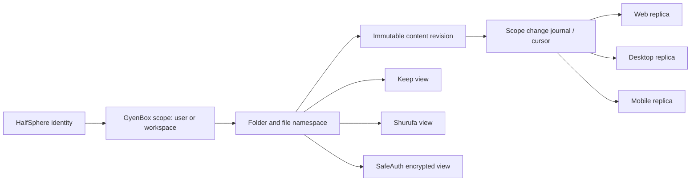

# GyenBox Unified Content Core

## Decision

GyenBox is the product's one content system. Keep, Shurufa, and SafeAuth are
applications over that system; they do not own independent storage trees,
independent authorization, or independent sync cursors.

Each account receives one visible, managed application folder:

```text
GyenBox/
  Apps/
    Keep/
      Notes/
      Attachments/
    Shurufa/
      Dictionaries/
    SafeAuth/
      Recovery/              # never contains plaintext secrets
```

The folder is created lazily when an application is first used. It is a normal
GyenBox folder for ownership, sharing, retention, trash, versioning, quota and
sync purposes. The application owns the presentation and validates its managed
content shape.

## Dropbox Core, expressed for GyenBox

The durable core has five concepts only:

1. **Identity and scope** — a personal user scope or a shared workspace scope.
2. **Namespace** — folders and files form the single content tree.
3. **Immutable revisions** — every visible content change has a revision.
4. **Change journal** — every scope has a monotonically increasing cursor.
5. **Local replica** — desktop, web and mobile cache a projection of the same
   remote namespace; they are never a competing source of truth.



The journal contains object identifiers, operation, revision and ordering only.
It never stores note bodies, dictionary words, or secrets. A client receives a
small change page, then fetches only the objects it does not already have.

## Core schema direction

`File` and `Folder` remain the namespace authority. The core adds a generic
content descriptor and an event stream; application tables are optional search
projections, not a second storage authority.

```text
ContentDescriptor
  fileId (unique)            -> File
  appKind                    -> FILE | KEEP_NOTE | DICTIONARY | SAFEAUTH_BLOB
  schemaVersion
  metadata (JSON, validated per app)
  contentRevision

ScopeStream
  scopeType + scopeId        -> user or workspace
  nextSequence

ScopeChange
  scopeType + scopeId + sequence
  subjectType + subjectId    -> FILE | FOLDER | CONTENT_DESCRIPTOR
  operation                  -> UPSERT | DELETE | MOVE | RESTORE
  revision
  occurredAt
```

All mutations of `File`, `Folder`, trash/restore, rename/move, share-relevant
metadata, and app descriptors append one `ScopeChange` in the same database
transaction. A cursor is valid only after the caller passes the normal
ownership/workspace permission check, so it cannot disclose someone else's
activity.

## Keep as managed content

A Keep note becomes one managed file in `Apps/Keep/Notes`:

```text
File
  name: <note id>.keep.json
  mimeType: application/vnd.gyenbox.keep-note+json
  parentId: Apps/Keep/Notes
  storageKey: immutable note document in GyenBox object storage
  FileVersion: normal GyenBox version history

KeepNoteIndex (projection, one-to-one with File)
  fileId
  title, excerpt, labels, reminder, pinned, archived, sortKey
```

`KeepNoteIndex` makes the Keep interface fast; it can always be rebuilt from
the file revision and therefore is not the source of truth. Attachments remain
ordinary GyenBox files under `Apps/Keep/Attachments`, linked from the note
document by immutable file ID. This lets a note be versioned, restored, shared,
downloaded and synchronized by the same engine as every other GyenBox item.

The currently shipped `KeepStream` / `KeepChange` remains as a compatibility
bridge until every Keep note has a `File` identity. It must not become a second
permanent sync system.

## Other applications

### Shurufa

Dictionary sources, user dictionaries and export snapshots live in
`Apps/Shurufa/Dictionaries`. Shurufa keeps an indexed projection for fast word
lookup, but GyenBox files and the common journal are canonical.

### SafeAuth

SafeAuth participates in the folder, version and sync model, but its payload is
always client-side encrypted before reaching GyenBox storage. The namespace may
contain encrypted vault blobs, recovery packages and non-sensitive metadata;
it must never contain a plaintext TOTP secret, recovery code or private key.

## Migration sequence

1. **Build the Core journal** — add `ScopeStream` / `ScopeChange`, expose
   `GET /api/changes?cursor=` for files and folders, and make existing GyenBox
   file mutations append events transactionally.
2. **Use it in the desktop client** — replace upload-only reconciliation with
   pull-by-cursor; keep the local SQLite database as a replica/cache, not a
   competing authority.
3. **Create the application roots** — idempotently create `Apps`, `Keep`,
   `Shurufa`, and `SafeAuth` roots only on first use.
4. **Migrate Keep safely** — backfill every existing note into a managed file,
   store its `fileId`, dual-write and compare revisions, then switch reads to
   the common journal. No note is deleted during this phase.
5. **Move Shurufa and SafeAuth** — each gets a validated descriptor and a
   projection; SafeAuth additionally requires encryption and recovery tests.
6. **Retire app-specific streams** — remove `KeepStream` only after production
   telemetry proves every active client is consuming the common cursor.

## Non-negotiable invariants

- One account and permission model: HalfSphere identity plus GyenBox ownership
  and workspace authorization.
- One object namespace: every user-visible application document has a `File`
  identity and a folder path.
- One revision history: app edits create GyenBox file versions.
- One cursor contract: clients synchronize object changes, not whole screens.
- One safe deletion model: tombstones stay in the journal long enough for every
  device to observe them; permanent purge is explicit and delayed.
- One quiet UX rule: replicas merge changes in place. No application may clear
  the visible page just to learn whether remote content changed.
